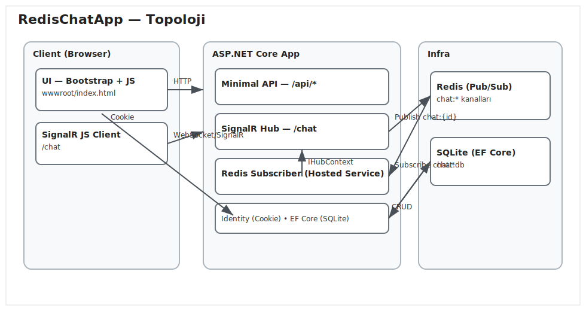
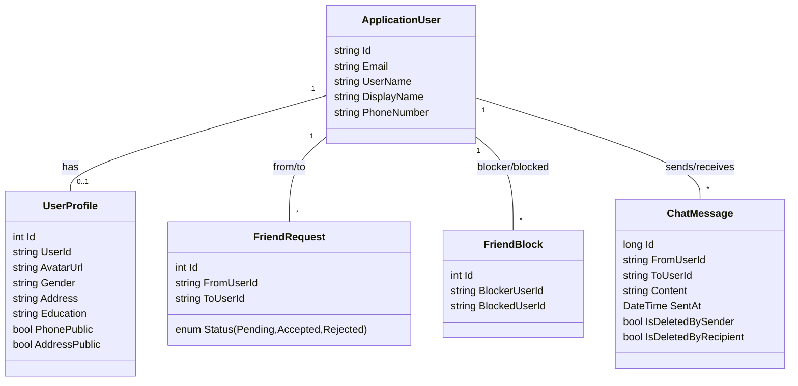
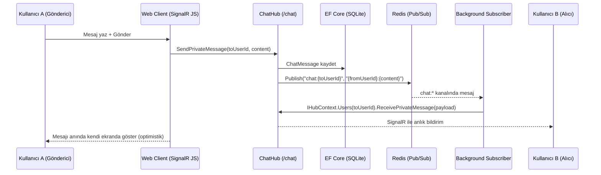

# RedisChatApp — Gerçek Zamanlı Özel Sohbet (ASP.NET Core + SignalR + Redis)

Bu proje; ASP.NET Core Minimal API, SignalR, Redis Pub/Sub ve EF Core (SQLite) ile gerçek zamanlı özel mesajlaşma uygulamasıdır. Kimlik doğrulama için ASP.NET Core Identity kullanır. Kullanıcı profilleri, arkadaşlık istekleri, engelleme ve mesaj geçmişi dahil sosyal özellikler içerir. İstemci arayüzü Bootstrap 5 ve vanilla JS ile tek bir sayfadan (`wwwroot/index.html`) çalışır.

## Topoloji (Mimari) Diyagramı

```mermaid
flowchart LR
    subgraph Client[Web Client (Bootstrap + JS)]
      UI[Index.html]
      HubClient[SignalR JS Client]
    end

    subgraph App[ASP.NET Core (Minimal API + SignalR Hub)]
      API[REST Endpoints /api/*]
      Hub[ChatHub (/chat)]
      BG[Background Service (Redis Subscriber)]
      Identity[ASP.NET Core Identity]
      EF[(EF Core SQLite)]
    end

    subgraph Redis[Redis Server]
      Channel[Pub/Sub Channels: chat:*]
    end

    UI -->|HTTP| API
    HubClient <-->|WebSocket/SignalR| Hub
    Hub -->|Publish chat:{toUserId}| Channel
    Channel -->|Subscribe| BG
    BG -->|IHubContext.Send| Hub
    API <-->|CRUD| EF
    Identity -. Cookies .- UI
```

Statik görsel (GitHub gibi ortamlarda garanti render için):



## Use Case Diyagramı (Özet)

> Mermaid yerel “use case” diyagramı sağlamadığından, başlıca aktörleri ve aksiyonları akış diyagramı ile özetliyoruz.

```mermaid
flowchart TB
    actorUser["Kullanıcı"]

    subgraph Kimlik & Profil
      UC1["Kayıt Ol"]
      UC2["Giriş Yap"]
      UC3["Çıkış Yap"]
      UC4["Profil Görüntüle/Düzenle"]
      UC5["Şifre Değiştir"]
    end

    subgraph Sosyal
      UC6["Kullanıcıları Listele"]
      UC7["Arkadaşlık İsteği Gönder"]
      UC8["İstekleri Görüntüle/Kabul-Reddet"]
      UC9["Arkadaşları Listele/Çıkar"]
      UC10["Kullanıcıyı Engelle/Engeli Kaldır"]
      UC11["Kullanıcı Profilini Görüntüle"]
    end

    subgraph Mesajlaşma
      UC12["Özel Mesaj Gönder"]
      UC13["Gelen Mesajı Al - Gerçek Zamanlı"]
      UC14["Mesaj Geçmişini Görüntüle"]
      UC15["Mesajı Sil - Yumuşak Silme"]
    end

    actorUser --> UC1 & UC2 & UC3 & UC4 & UC5
    actorUser --> UC6 & UC7 & UC8 & UC9 & UC10 & UC11
    actorUser --> UC12 & UC13 & UC14 & UC15
```



## UML — Sınıf Diyagramı (Önemli Varlıklar)



## UML — Sekans Diyagramı (Özel Mesaj Gönderimi)



## İşleyiş (Özet)

- Kimlik Doğrulama: Identity Cookie tabanlı. `/api/auth/register`, `/api/auth/login`, `/api/auth/logout`, `/api/auth/me` uçları.
- Profil Yönetimi: `/api/profile` ile kendi profilini gör/düzenle; avatar ve gizlilik bayrakları (telefon/adres).
- Kullanıcı ve Arkadaşlar: `/api/users`, `/api/friends`, `/api/friends/requests`, `/api/friends/request`, `/api/friends/respond`, `/api/friends/remove` uçları. Avatar bilgisi listelere eklenir.
- Engelleme: `/api/friends/block`, `/api/friends/unblock`, `/api/friends/blocks` uçları. Engellenen kullanıcıdan mesaj kabul edilmez.
- Mesajlaşma:
  - Gerçek zamanlı: SignalR Hub yolu `/chat`.
  - Gönderim: Hub mesajı DB’ye yazar ve Redis `chat:{toUserId}` kanalına yayınlar.
  - Alım: Hosted service `chat:*` kanallarını dinler ve `IHubContext` ile ilgili kullanıcıya iletir.
  - Geçmiş: `/api/messages/{otherId}` ile çekilir, yumuşak silme bayraklarına göre filtrelenir.
  - Silme: `/api/messages/{id}/delete` çağrısı, sadece çağıran taraf için görünürlüğü kapatır.
- İstemci UX:
  - Gelen mesajda karşı tarafın sohbeti otomatik açılır ve başlık “Özel Sohbet: {Ad}” olur.
  - Mesaj balonlarında kullanıcı adı gösterilir.
  - Son açılan sohbet `localStorage` ile hatırlanır; yenilemede geri yüklenir.

## Kullanılan Teknolojiler

- .NET 9.0, ASP.NET Core (Minimal APIs)
- SignalR (WebSockets/Long Polling yedekli)
- StackExchange.Redis (Pub/Sub)
- EF Core (SQLite)
- ASP.NET Core Identity (Cookie Authentication)
- Bootstrap 5 (UI) + Vanilla JavaScript (SignalR JS Client)

## Redis ve SQLite Rolleri

### Redis ne yapıyor? (Gerçek zamanlı pub/sub)

- Amaç: Mesajları anında ilgili kullanıcıya iletmek ve çoklu uygulama örneğinde (scale-out) dağıtımı sağlamak.
- Akış:
  - Kullanıcı A mesaj gönderir → ChatHub önce mesajı DB’ye yazar, ardından Redis kanalına yayınlar: `chat:{toUserId}`.
  - Arka plan abonelik servisi (Hosted Service) Redis’te `chat:*` kanallarını dinler.
  - Gelen yayınları `IHubContext` ile hedef kullanıcıya (SignalR) push eder.
- Neden Redis: Düşük gecikme, pub/sub ile fan-out; birden fazla uygulama örneğinde mesajların tutarlı iletilmesi.
- Not: Redis burada kalıcılık için kullanılmaz; cache/queue verisi tutulmaz.

### SQLite ne yapıyor? (Kalıcı veritabanı)

- Amaç: Uygulama verilerini kalıcı saklamak (kimlik, sosyal ilişkiler, mesaj geçmişi).
- Saklanan başlıca varlıklar: `ApplicationUser`, `UserProfile`, `FriendRequest`, `FriendBlock`, `ChatMessage` (yumuşak silme bayrakları ile).
- Akış: Mesaj gönderimde önce `ChatMessage` verisi DB’ye yazılır; geçmiş bu tablodan çekilir. Arkadaşlık/engelleme kontrolleri de DB üzerindendir.
- Neden SQLite: Dosya tabanlı, kurulum gerektirmez; geliştirme/demo için idealdir. Üretimde PostgreSQL/SQL Server’a taşınabilir.

### Özet akış (ikisini birlikte)

1) Hub: Mesajı DB’ye kaydet (SQLite).
2) Hub: Redis’e publish et (`chat:{toUserId}`).
3) Subscriber: Redis’ten al, SignalR ile alıcıya anlık ilet.

## Yapılandırma

`appsettings.json` örneği:

```json
{
  "ConnectionStrings": {
    "Default": "Data Source=chat.db"
  },
  "Redis": {
    "ConnectionString": "localhost:6379,abortConnect=false"
  },
  "Logging": {
    "LogLevel": { "Default": "Information", "Microsoft": "Warning" }
  }
}
```

- Redis bağlantısı: `Redis:ConnectionString` (varsayılan: `localhost:6379,abortConnect=false`).
- SQLite dosyası: `ConnectionStrings:Default` (varsayılan: `Data Source=chat.db`).

## API Yüzeyi (Özet)

- Auth
  - POST `/api/auth/register` { email, password, displayName }
  - POST `/api/auth/login` { email, password }
  - POST `/api/auth/logout`
  - GET `/api/auth/me` → { id, email, displayName }
- Kullanıcılar & Arkadaşlar
  - GET `/api/users` → [{ id, email, displayName, avatarUrl }]
  - GET `/api/friends` → [{ id, email, displayName, avatarUrl }]
  - GET `/api/friends/requests` → { incoming, outgoing }
  - POST `/api/friends/request` { toUserId }
  - POST `/api/friends/respond` { requestId, accept }
  - POST `/api/friends/remove` { userId }
  - GET `/api/users/{id}` → profil (gizlilik kuralları uygulanır)
- Engelleme
  - GET `/api/friends/blocks` → [ userId ]
  - POST `/api/friends/block` { userId }
  - POST `/api/friends/unblock` { userId }
- Mesajlar
  - GET `/api/messages/{otherId}` → kronolojik geçmiş (yumuşak silme filtreli)
  - POST `/api/messages/{id}/delete`
- Hub
  - `/chat` (SignalR)
  - Method: `SendPrivateMessage(toUserId, content)`
  - Client callback: `ReceivePrivateMessage("{fromUserId}:{content}")`

Tüm `/api/*` uçları kimlik doğrulaması gerektirir (aksini belirtenler hariç). Bazı uçlarda `RequireAuthorization()` açıkça tanımlıdır.

## Veritabanı Şeması (SQLite)

- Tablolar otomatik oluşturulur (`EnsureCreated`) ve gerekli ek tablolar için `CREATE TABLE IF NOT EXISTS` kullanılır:
  - `UserProfiles(Id, UserId, AvatarUrl, Gender, Address, Education, PhonePublic, AddressPublic)`
  - `FriendBlocks(Id, BlockerUserId, BlockedUserId)`
  - `ChatMessages(Id, FromUserId, ToUserId, Content, SentAt, IsDeletedBySender, IsDeletedByRecipient)`

Arkadaşlık ilişkileri `FriendRequests` üzerinden yönetilir; kabul edilen çiftler arkadaş listesine yansır.

## Çalıştırma

- Gereksinimler: .NET SDK 9, Redis sunucusu (lokalde veya uzak)
- Windows/cmd için tipik adımlar:

```bat
:: bağımlılıkları derle
dotnet build .\RedisChatApp.csproj

:: uygulamayı çalıştır
dotnet run --project .\RedisChatApp.csproj
```

- Varsayılan adres: http://localhost:5000 (veya Kestrel çıktısına göre). Tarayıcıda açıldığında `wwwroot/index.html` yüklenir.

### Docker ve Docker Compose ile Çalıştırma

Ön koşul: Docker Desktop yüklü olmalı.

1) Görselleri build edip servisleri ayağa kaldırın

```cmd
docker compose up -d --build
```

2) Uygulama adresi

- Web: http://localhost:8080
- Redis: localhost:6379

3) Ortam değişkenleri (compose dosyasında ayarlı)

- ASPNETCORE_URLS = http://0.0.0.0:8080
- Redis__ConnectionString = redis:6379,abortConnect=false
- ConnectionStrings__Default = Data Source=/data/chat.db

4) Durdurma ve loglar

```cmd
docker compose logs -f
docker compose down
```

Upstash Redis ile çalıştırma (local Redis olmadan)

1) `.env` oluşturun ve Upstash bilgisini ekleyin (örneğe bakın `.env.example`):

```env
REDIS_CONNECTION_STRING=open-adder-8344.upstash.io:6379,password=ASCYAAImcDFlYTEzNzRjMzQ5YWY0N2Q1YWRhZTA3NTBhNzY3NTg3NXAxODM0NA,ssl=True,abortConnect=false
```

2) Sadece web konteynerini çalıştırın (redis servisini atlayın):

```cmd
docker compose up -d --build web
```

Not: Local Redis ile çalıştırmak isterseniz profil kullanın:

```cmd
docker compose --profile local up -d --build
```

### NU1301 / UntrustedRoot (Docker build) Çözümü

Kurumsal proxy veya özel kök sertifika (CA) varsa `dotnet restore` sırasında TLS hatası (NU1301) alabilirsiniz. Çözüm:

1) Özel CA sertifikanızı `.crt` (PEM) formatında `certs/` klasörüne koyun (örnek: `certs/corporate-root-ca.crt`).

2) Gerekliyse proxy bilgilerini build arg olarak geçin:

```cmd
docker compose build --build-arg HTTP_PROXY=http://proxy:8080 --build-arg HTTPS_PROXY=http://proxy:8080 --build-arg NO_PROXY=localhost,127.0.0.1
```

Dockerfile, `certs/*.crt` dosyalarını güvenilir sertifika deposuna ekler ve `HTTP_PROXY/HTTPS_PROXY/NO_PROXY` arglarını onurlandırır.

## Notlar ve İpuçları

- Geliştirme sırasında exe kilitlenmesi: Çalışan uygulama açıkken yeniden derleme kopyalama hatası verebilir. Önce çalışan süreci durdurup sonra `dotnet build`/`run` çağırın.
- Redis olmadan çalıştırma: Hub başlar, ancak gerçek zamanlı bildirimler iletilmez. Mesaj geçmişi API’leri yine de çalışır.
- Avatar alanı URL veya data URI (base64) olabilir. Bozuk görseller için yer tutucu gösterilir.
- Gizlilik: Telefon/adres alanları diğer kullanıcılar tarafından yalnızca `PhonePublic`/`AddressPublic` açık ise görülür.

## Güvenlik ve Yetkilendirme

- Kimlik: Cookie tabanlı oturum. Kayıt ve giriş sonrası `isPersistent: true` ile kullanıcı oturumu korunur.
- Hub ve API’lerde `[Authorize]`/`RequireAuthorization()` uygulanır; engelleme kontrolleri ve arkadaşlık doğrulamaları mesaj gönderiminde yapılır.

## Yol Haritası (Öneriler)

- Mesaj sayfalama ve zaman damgası formatlama
- Son görüşmeler listesi ve arama/filtreleme
- Bildirimler (tarayıcı veya e-posta)
- Birim testler ve daha güçlü hata yönetimi

---
Bu dosya, uygulamanın mimarisini, akışlarını ve uç noktalarını hızlıca kavramak isteyenler için kapsamlı bir referans olarak hazırlanmıştır.

## Geliştirici

- Azat Tekçe
